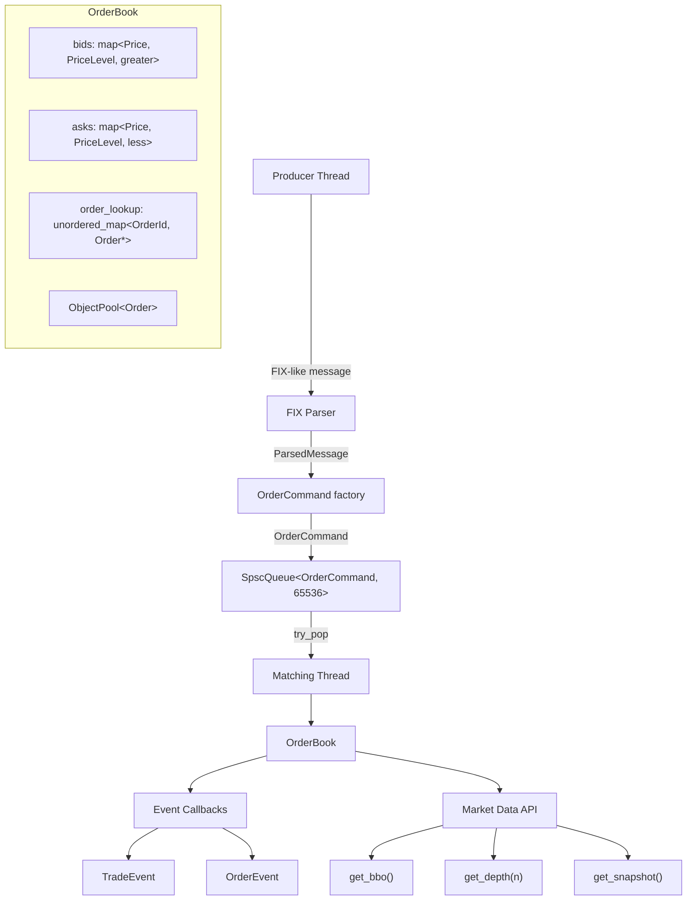

# Order Matching Engine

A high-performance limit order matching engine implemented in modern C++17.

[](https://github.com/dengelbarts/c-_order_matching_engine/actions/workflows/ci.yml)

## Status

✅ **v1.0.0** — Production-ready. All 25 days complete. — `v1.0.0`

### Implementation Progress

- [x] Phase 1: Core Matching Engine (Days 1-10) — `v0.1.0-core`
  - [x] Day 1: Project Setup & Build System
  - [x] Day 2: Price Representation & Core Enums
  - [x] Day 3: Order Struct
  - [x] Day 4: PriceLevel Class
  - [x] Day 5: OrderBook Data Structures & Add Order
  - [x] Day 6: OrderBook Cancel & Best Bid/Offer (BBO)
  - [x] Day 7: Limit Order Matching Engine
  - [x] Day 8: Multi-level Matching & Edge Cases
  - [x] Day 9: Trade Output & Event System
  - [x] Day 10: Phase 1 Integration & Review (86 tests, ASan clean, DESIGN.md)
- [x] Phase 2: Extended Order Types (Days 11-15) — `v0.2.0-extended`
  - [x] Day 11: Market Orders (94 tests)
  - [x] Day 12: IOC (Immediate or Cancel) Orders (103 tests)
  - [x] Day 13: FOK (Fill or Kill) Orders (113 tests)
  - [x] Day 14: Order Amendments (122 tests)
  - [x] Day 15: Phase 2 Integration & Review (133 tests, ASan clean, DESIGN.md)

- [x] Phase 3: Performance Optimization (Days 16-20) — `v0.3.0-performance`
  - [x] Day 16: Baseline Benchmarks — `day-16`
  - [x] Day 17: Memory Pool (ObjectPool) — `day-17`
  - [x] Day 18: Hot-Path Optimization — `day-18`
  - [x] Day 19: Realistic Benchmark Suite — `day-19`
  - [x] Day 20: Performance Polish & Documentation — `day-20`
- [x] Phase 4: Multithreading & Final Polish (Days 21-25) — `v1.0.0`
  - [x] Day 21: SPSC Lock-Free Queue — `day-21`
  - [x] Day 22: Producer-Consumer Threading — `day-22`
  - [x] Day 23: Market Data API & FIX Parser — `day-23`
  - [x] Day 24: README, CI & Documentation — `day-24`
  - [x] Day 25: Final Review & Ship — `v1.0.0`

## Features

- Price-time priority matching (FIFO per price level)
- Order types: Limit, Market, IOC, FOK
- Order amendments and cancellations
- Lock-free SPSC queue for producer-consumer threading
- Memory pooling for zero-allocation hot path
- Asynchronous `MatchingPipeline`: input thread decoupled from matching thread
- Market data API: `get_bbo()`, `get_depth(n)`, `get_snapshot()`
- FIX-like message parser: `NEW`, `CANCEL`, `AMEND` via `std::string_view` (zero-copy)
- 172K+ orders/second sustained throughput (Release, GCC 13.3, `-O3`)
- Benchmark suite: throughput, latency percentiles, cancel-heavy, deep-book stress

## Architecture



| Component | File | Role |
|-----------|------|------|
| `Price` / `Order` | `price.hpp`, `order.hpp` | Fixed-point price, 64-byte cache-aligned order struct |
| `PriceLevel` | `price_level.hpp` | FIFO deque per price point |
| `OrderBook` | `order_book.hpp` | Matching engine, BBO, amendments, event callbacks |
| `ObjectPool<T>` | `object_pool.hpp` | Pre-allocated slab; O(1) alloc/free on the hot path |
| `SpscQueue<T,N>` | `spsc_queue.hpp` | Wait-free ring buffer; one cache line per index |
| `OrderCommand` | `order_command.hpp` | 64-byte command struct passed through the queue |
| `MatchingPipeline` | `matching_pipeline.hpp` | Owns queue + matching thread; decouples producers |
| `FIX parser` | `fix_parser.hpp` | Zero-copy `string_view` parser for NEW/CANCEL/AMEND |

## Building
```bash
# Configure
cmake -S . -B build -DCMAKE_BUILD_TYPE=Release

# Build
cmake --build build

# Run tests
cd build && ctest --output-on-failure

# Run main executable
./build/ome_main

# Run full benchmark suite (Release build required)
cmake -S . -B build/release -DCMAKE_BUILD_TYPE=Release
cmake --build build/release --parallel
cmake --build build/release --target bench
```

## Usage

### Running the demo

```bash
./build/ome_main
```

Sample output:

```
=== Order Matching Engine v0.1.0 - Phase 1 Demo ===

--- Adding resting orders ---
[ORDER] OrderEvent{type=New, id=1, side=Sell, price=10.5000, orig=100, filled=0, rem=100}
[ORDER] OrderEvent{type=New, id=2, side=Sell, price=10.2500, orig=75, filled=0, rem=75}
[ORDER] OrderEvent{type=New, id=3, side=Sell, price=10.0000, orig=50, filled=0, rem=50}
[ORDER] OrderEvent{type=New, id=4, side=Buy, price=9.7500, orig=80, filled=0, rem=80}
[ORDER] OrderEvent{type=New, id=5, side=Buy, price=9.5000, orig=60, filled=0, rem=60}

BBO: bid 9.7500 x 80 | ask 10.0000 x 50
Spread: 0.2500

--- Aggressive buy (qty 120 @ 10.50) <<<
[ORDER] OrderEvent{type=Filled, id=3, side=Sell, price=10.0000, orig=50, filled=50, rem=0}
[TRADE] TradeEvent{id=1, buy=6, sell=3, price=10.0000, qty=50}
[ORDER] OrderEvent{type=PartialFill, id=2, side=Sell, price=10.2500, orig=75, filled=70, rem=5}
[TRADE] TradeEvent{id=2, buy=6, sell=2, price=10.2500, qty=70}
[ORDER] OrderEvent{type=Filled, id=6, side=Buy, price=10.5000, orig=120, filled=120, rem=0}

After sweep:
Best bid: 9.7500 x 80
Best ask: 10.2500 x 5

--- Stats ---
Total orders added to book : 5
Total trades executed      : 2
Total volume traded        : 120
```

### FIX-like message format

```
NEW|side=BUY|price=10.50|qty=100
NEW|side=SELL|qty=200|price=9.75
CANCEL|id=42
AMEND|id=7|qty=150|price=10.25
```

Fields may appear in any order. The parser returns a `ParsedMessage` with a `bool valid` flag and `const char* error` on failure.

### Using the MatchingPipeline

```cpp
MatchingPipeline pipeline;
pipeline.start();

// Any producer thread:
pipeline.submit(OrderCommand::make_new(1, Side::Buy, to_price(10.50), 100, 1, 1));
pipeline.submit(OrderCommand::make_cancel(42));

// Drains all queued commands before joining the matching thread:
pipeline.shutdown();
```

## Requirements

- CMake 3.14+
- C++17 compatible compiler (GCC 7+, Clang 5+, MSVC 2017+)
- Google Test (fetched automatically)

## License

MIT License - see [LICENSE](LICENSE) file for details.

## Documentation

See [docs/DESIGN.md](docs/DESIGN.md) for architectural decisions and implementation details.

## Development Timeline

This project follows a 25-day structured implementation plan. Each day's work is tagged for easy reference and code review.

### Git Tag Index

| Tag | Date | Description | Status |
|-----|------|-------------|--------|
| [`day-1`](../../tree/day-1) | Feb 9, 2026 | Project setup & build system | ✅ Complete |
| [`day-2`](../../tree/day-2) | Feb 10, 2026 | Price representation & core enums | ✅ Complete |
| [`day-3`](../../tree/day-3) | Feb 11, 2026 | Order struct | ✅ Complete |
| [`day-4`](../../tree/day-4) | Feb 12, 2026 | PriceLevel class | ✅ Complete |
| [`day-5`](../../tree/day-5) | Feb 13, 2026 | OrderBook data structures | ✅ Complete |
| [`day-6`](../../tree/day-6) | Feb 14, 2026 | OrderBook cancel & BBO | ✅ Complete |
| [`day-7`](../../tree/day-7) | Feb 15, 2026 | Limit order matching | ✅ Complete |
| [`day-8`](../../tree/day-8) | Feb 16, 2026 | Multi-level matching & edge cases | ✅ Complete |
| [`day-9`](../../tree/day-9) | Feb 17, 2026 | Trade output & event system | ✅ Complete |
| [`day-10`](../../tree/day-10) | Feb 18, 2026 | **Phase 1 complete** | ✅ Complete |
| | | |
| **Milestone** | | [`v0.1.0-core`](../../tree/v0.1.0-core) | Phase 1: Core matching engine |
| [`day-11`](../../tree/day-11) | Feb 19, 2026 | Market orders | ✅ Complete |
| [`day-12`](../../tree/day-12) | Feb 20, 2026 | IOC orders | ✅ Complete |
| [`day-13`](../../tree/day-13) | Feb 21, 2026 | FOK orders | ✅ Complete |
| [`day-14`](../../tree/day-14) | Feb 22, 2026 | Order amendments | ✅ Complete |
| [`day-15`](../../tree/day-15) | Feb 23, 2026 | **Phase 2 complete** | ✅ Complete |
| | | |
| **Milestone** | | [`v0.2.0-extended`](../../tree/v0.2.0-extended) | Phase 2: Extended order types |
| [`day-16`](../../tree/day-16) | Feb 24, 2026 | Baseline benchmarks | ✅ Complete |
| [`day-17`](../../tree/day-17) | Feb 25, 2026 | Memory pool (ObjectPool) | ✅ Complete |
| [`day-18`](../../tree/day-18) | Feb 26, 2026 | Hot-path optimization | ✅ Complete |
| [`day-19`](../../tree/day-19) | Feb 27, 2026 | Realistic benchmark suite | ✅ Complete |
| [`day-20`](../../tree/day-20) | Feb 28, 2026 | **Phase 3 complete** — bench automation & docs | ✅ Complete |
| | | |
| **Milestone** | | [`v0.3.0-performance`](../../tree/v0.3.0-performance) | Phase 3: Performance optimization |
| [`day-21`](../../tree/day-21) | Mar 1, 2026 | SPSC lock-free queue | ✅ Complete |
| [`day-22`](../../tree/day-22) | Mar 2, 2026 | Producer-consumer threading pipeline | ✅ Complete |
| [`day-23`](../../tree/day-23) | Mar 3, 2026 | Market data API & FIX parser | ✅ Complete |
| [`day-24`](../../tree/day-24) | Mar 4, 2026 | CI & documentation | ✅ Complete |
| [`day-25`](../../tree/day-25) | Mar 5, 2026 | **Final release** | ✅ Complete |
| | | |
| **Milestone** | | [`v1.0.0`](../../tree/v1.0.0) | 🚀 Production-ready order matching engine |

### Quick Navigation

```bash
# View code at any point in development
git checkout day-2    # See Day 2: Price implementation
git checkout day-10   # See Phase 1 completion
git checkout v1.0.0   # See final version

# Compare progress between days
git diff day-1..day-2
git diff day-5..day-10

# Return to latest
git checkout main
```

### Daily Progress Details

<details>
<summary><b>Day 1:</b> Project Setup & Build System</summary>

- ✅ GitHub repository structure
- ✅ CMake build system (C++17)
- ✅ Compiler flags: `-Wall -Wextra -Wpedantic -Werror`
- ✅ Google Test integration
- ✅ Directory structure: `/include`, `/src`, `/test`
- ✅ Hello-world compiles successfully
</details>

<details>
<summary><b>Day 2:</b> Price Representation & Core Enums</summary>

- ✅ Price type: `int64_t` fixed-point (4 decimal places)
- ✅ Conversion functions: `to_price()`, `to_double()`, `price_to_string()`
- ✅ `enum class Side { Buy, Sell }`
- ✅ `enum class OrderType { Limit, Market, IOC, FOK }`
- ✅ Comprehensive test suite: 7/7 tests passing
- ✅ Edge cases: negatives, rounding, precision
</details>

<details>
<summary><b>Day 3:</b> Order Struct</summary>

- ✅ Order struct with all required fields (order_id, symbol_id, side, price, quantity, timestamp, order_type)
- ✅ Cache-line optimized: `sizeof(Order) <= 64 bytes`
- ✅ OrderId generator: atomic counter for unique, monotonic IDs
- ✅ Timestamp helper: nanosecond precision using `std::chrono::steady_clock`
- ✅ Debug output operator `operator<<` for Order
- ✅ Comprehensive test suite: 11 tests passing
- ✅ Thread-safety verified for ID generation
</details>

<details>
<summary><b>Day 4:</b> PriceLevel Class</summary>

- ✅ PriceLevel class using `std::deque<Order*>` for FIFO ordering
- ✅ `add_order()`: O(1) append to back
- ✅ `remove_order(OrderId)`: find and erase by ID
- ✅ `get_total_quantity()`: aggregate quantity at price level
- ✅ `front()`: access best time-priority order
- ✅ `is_empty()` and `order_count()`: state queries
- ✅ Comprehensive test suite: 11 tests passing
- ✅ FIFO ordering verified, all edge cases covered
- ✅ Total tests: 33 (all passing)
</details>

<details>
<summary><b>Day 5:</b> OrderBook Data Structures & Add Order</summary>

- ✅ OrderBook class with dual-sided order storage
- ✅ Bid side: `std::map<Price, PriceLevel, std::greater<Price>>` (descending order)
- ✅ Ask side: `std::map<Price, PriceLevel, std::less<Price>>` (ascending order)
- ✅ Order lookup: `std::unordered_map<OrderId, Order*>` for O(1) access
- ✅ `add_order()`: insert into correct side and price level
- ✅ Automatic PriceLevel creation when price not in book
- ✅ `get_order()` and `has_order()`: fast order retrieval by ID
- ✅ Comprehensive test suite: 8 tests passing
  - Add single buy/sell orders
  - Add multiple orders at same price (FIFO verified)
  - Add orders on both sides
  - Bid side sorted descending (best bid first)
  - Ask side sorted ascending (best ask first)
  - Order retrieval by ID
  - Non-existent order handling
- ✅ Total tests: 41 (all passing)
</details>

<details>
<summary><b>Day 6:</b> OrderBook Cancel & Best Bid/Offer (BBO)</summary>

- ✅ `cancel_order(OrderId)`: remove orders from book and lookup map
- ✅ Ghost level cleanup: automatically remove empty price levels after cancel
- ✅ `get_best_bid()`: returns highest bid price + aggregated quantity
- ✅ `get_best_ask()`: returns lowest ask price + aggregated quantity
- ✅ `get_spread()`: calculates bid-ask spread with validity checking
- ✅ BBO struct with `valid` flag for empty book handling
- ✅ Spread struct with `valid` flag for one-sided book handling
- ✅ Comprehensive test suite: 20 new tests passing
  - Cancel existing/non-existent orders
  - Cancel and verify only target order removed
  - Ghost level cleanup verification
  - BBO on empty/single-order/multi-level books
  - BBO quantity aggregation at same price
  - BBO updates after cancellations
  - Spread calculation: empty book, one-sided, tight/wide markets
  - Spread updates after cancel
- ✅ Total tests: 61 (all passing)
</details>

<details>
<summary><b>Day 7:</b> Limit Order Matching Engine</summary>

- ✅ Trade struct with `TradeId` generator (atomic counter)
- ✅ Core `match()` function implementing price-time priority
- ✅ Buy order matching: walk asks from lowest price upward
- ✅ Sell order matching: walk bids from highest price downward
- ✅ Exact fills: orders fully matched and removed from book
- ✅ Partial fills: orders partially matched, remainder rests in book
- ✅ Price improvement: trades execute at resting order's price
- ✅ Multi-level matching: orders sweep through multiple price levels
- ✅ FIFO ordering: earliest orders at each price level match first
- ✅ Automatic cleanup: fully filled orders removed from lookup map
- ✅ Comprehensive test suite: 9 new tests passing
  - ExactMatch: buy/sell at same price fully fills both orders
  - PartialFillBuyRemains: buy fills partially, 50 shares remain in book
  - PartialFillSellRemains: sell fills partially, remainder rests
  - PriceImprovement: buy@10.50 matches sell@10.00, trades at $10.00
  - NoMatch: non-crossing orders (buy@9.00 vs sell@10.00) both rest
  - SellMatchesAgainstBid: sell order matching logic verified
  - FIFOOrdering: first order at price level matches first
  - MultiLevelMatching: buy sweeps 2 ask levels ($9.50, $10.00)
  - MultiLevelMatchingSell: sell sweeps 3 bid levels ($10.50, $10.00, $9.50)
- ✅ **Total tests: 70 (all passing)**
- ✅ **Core matching engine now functional!** 🎯
</details>

<details>
<summary><b>Day 8:</b> Multi-level Matching & Edge Cases</summary>

- ✅ Added `TraderId` field to Order struct (separate from `symbol_id`)
- ✅ Self-match prevention: orders with same `trader_id` won't match
- ✅ Industry-standard implementation (follows CME, Nasdaq, ICE practices)
- ✅ Multi-level sweeping: verified orders sweep through multiple price levels
- ✅ Edge case handling: empty book, single-sided book behaviors
- ✅ Comprehensive test suite: 8 new tests passing
  - SelfMatchPreventionBuy: buy order doesn't match own sells
  - SelfMatchPreventionSell: sell order doesn't match own buys
  - DifferentTradersMatch: different traders can match (normal behavior)
  - SelfMatchPreventionMultiLevel: self-match prevention across price levels
  - EmptyBookMatching: no crashes on empty book
  - SingleSidedBookBidsOnly: handles all-bid books safely
  - SingleSidedBookAsksOnly: handles all-ask books safely
  - SweepMultipleLevels: order sweeps 3 levels (300 qty total)
- ✅ **Total tests: 78 (all passing)**
- ✅ **Self-match prevention complete!** 🛡️
</details>

<details>
<summary><b>Day 9:</b> Trade Output & Event System</summary>

- ✅ `OrderEventType` enum: `New`, `Cancelled`, `Filled`, `PartialFill`
- ✅ `OrderEvent` struct: captures order lifecycle events with full context (original_qty, filled_qty, remaining_qty)
- ✅ `TradeEvent` struct: mirrors Trade for callback-based consumption
- ✅ Human-readable `operator<<` for both event types
- ✅ Callback mechanism: `set_trade_callback()` and `set_order_callback()` via `std::function`
- ✅ `add_order()` fires `OrderEventType::New` on every resting order
- ✅ `cancel_order()` fires `OrderEventType::Cancelled`
- ✅ `match()` fires `TradeEvent` + `Filled`/`PartialFill` per resting order consumed, then `Filled`/`PartialFill` for the incoming order
- ✅ Event ordering guaranteed: resting order event fires before incoming order event
- ✅ `Stats` tracker: `total_orders`, `total_trades`, `total_volume`
- ✅ Integration test: 22-order scenario verifying all event counts and statistics
- ✅ Comprehensive test suite: 8 new tests passing
  - AddOrderFiresNewEvent: New event with correct fields
  - CancelOrderFiresCancelledEvent: Cancelled event on cancel
  - ExactMatchFiresTradeAndFillEvents: 2 Filled events + 1 TradeEvent
  - PartialFillIncomingOrderEvents: Filled + PartialFill + New for remainder
  - NoMatchOnlyNewEvent: no trade events when prices don't cross
  - StatsTracking: counters accurate after mixed order sequence
  - EventOrderAddMatchTrade: resting order event precedes incoming order event
  - IntegrationTest22Orders: 22 orders, 15 trades, 1500 volume, all counts verified
- ✅ **Total tests: 86 (all passing)**
- ✅ **Event system complete — order book is fully observable!** 📡
</details>

<details>
<summary><b>Day 10:</b> Phase 1 Integration & Review</summary>

- ✅ Full test suite run: 86/86 tests passing
- ✅ AddressSanitizer build target added (`-DENABLE_ASAN=ON`), zero warnings
- ✅ Code review: raw pointers in public interface confirmed intentional (non-owning, performance-justified)
- ✅ RAII compliance verified: `OrderBook` and `PriceLevel` destruct cleanly without leaks
- ✅ `docs/DESIGN.md` written: data structure choices, complexity analysis, memory model, build targets
- ✅ Phase 1 demo `main.cpp` updated: two-sided book, aggressive sweep, live event output
- ✅ Tagged `v0.1.0-core`
- ✅ **Total tests: 86 (all passing)** ✅
- ✅ **Phase 1 complete — core matching engine production-ready!** 🚀
</details>

<details>
<summary><b>Day 11:</b> Market Orders</summary>

- ✅ Market order type implemented in `match()`: buy sets price to `INT64_MAX`, sell sets price to `0`
- ✅ Market buy sweeps asks from lowest price upward, matching everything in its path
- ✅ Market sell sweeps bids from highest price downward, matching everything in its path
- ✅ Unfilled remainder is cancelled (never rests in the book), with `Cancelled` event fired
- ✅ Market order against empty book immediately cancels with zero trades
- ✅ All existing limit order tests continue to pass (no regressions)
- ✅ Comprehensive test suite: 8 new tests passing
  - MarketBuyFullFill: market buy fully consumes a single ask
  - MarketBuyMultiLevel: market buy sweeps two price levels at $10.00 and $11.00
  - MarketBuyPartialFillRemainderCancelled: partial fill, remainder cancelled, not in book
  - MarketBuyEmptyBook: zero trades, order immediately cancelled
  - MarketSellFullFill: market sell fully consumes a single bid
  - MarketSellPartialFillRemainderCancelled: partial fill, remainder cancelled
  - MarketSellEmptyBook: zero trades, order immediately cancelled
  - MarketOrderFiresCancelEventOnEmptyBook: `Cancelled` event fires with `remaining_qty = 0`
- ✅ **Total tests: 94 (all passing)**
- ✅ **Market orders complete — book now supports Limit + Market!** 🏪
</details>

<details>
<summary><b>Day 12:</b> IOC (Immediate or Cancel) Orders</summary>

- ✅ IOC order type implemented in `match()`: executes available quantity at limit price or better, cancels remainder
- ✅ Key distinction from Market: IOC **respects its limit price** — will not sweep beyond it
- ✅ Key distinction from Limit: IOC **never rests in the book** — any unfilled portion is immediately cancelled
- ✅ `Cancelled` event fired for any unfilled remainder (zero-fill or partial-fill cases)
- ✅ `PartialFill` event fires before `Cancelled` when some quantity was matched
- ✅ All existing Limit and Market order tests continue to pass (no regressions)
- ✅ Comprehensive test suite: 9 new tests passing
  - IOCBuyFullFill: IOC buy fully consumes a resting ask
  - IOCBuyPartialFill: IOC buy fills 50, cancels remaining 50 — never rests in book
  - IOCBuyNoFillPriceMismatch: IOC buy@9.00 vs ask@10.00, zero fills, order cancelled
  - IOCBuyEmptyBook: zero trades, order immediately cancelled
  - IOCBuyRespectsLimitPrice: IOC@10.50 matches ask@10.00 but not ask@11.00
  - IOCSellFullFill: IOC sell fully consumes a resting bid
  - IOCSellPartialFill: IOC sell partial fill, remainder cancelled
  - IOCFiresCancelEventOnNoFill: `Cancelled` event fires with `remaining_qty = 0`
  - IOCFiresPartialFillThenCancelEvents: correct event sequence — `PartialFill` then `Cancelled`
- ✅ **Total tests: 103 (all passing)**
- ✅ **IOC orders complete — book now supports Limit + Market + IOC!** ⚡
</details>

<details>
<summary><b>Day 13:</b> FOK (Fill or Kill) Orders</summary>

- ✅ `can_fill()` check: walks the opposite side of the book read-only to verify the full quantity is available at the limit price or better — no book state modified
- ✅ FOK buy: if `can_fill()` returns false, `Cancelled` event fires immediately and zero trades are returned
- ✅ FOK sell: same logic applied to the bid side
- ✅ Key distinction from IOC: FOK requires **all-or-nothing** — partial fills are never allowed; either the entire quantity fills or the order is killed outright
- ✅ Key distinction from Market: FOK respects its limit price — will not match beyond it
- ✅ Any remainder after execution (e.g. due to self-match prevention) is cancelled, never rested
- ✅ All existing Limit, Market, and IOC tests continue to pass (no regressions)
- ✅ Comprehensive test suite: 10 new tests passing
  - FOKBuySingleLevel: FOK buy 100@10 against [100@10] fills with 1 trade
  - FOKBuyFullFillMultiLevel: FOK buy 100@10 against [60@10, 40@10] produces 2 trades
  - FOKBuyKilledInsufficientQty: FOK buy 100@10 against [50@10] killed, resting order untouched
  - FOKBuyKilledPriceMismatch: FOK buy@9 against sell@10 killed immediately
  - FOKBuyEmptyBook: zero trades, order killed, never rests
  - FOKSellFullFill: FOK sell fully consumes a resting bid
  - FOKSellKilledInsufficientQty: FOK sell killed, resting bid quantity unchanged
  - FOKFiresCancelEventOnKill: `Cancelled` event fires with `filled_qty = 0`, `remaining_qty = 0`
  - FOKFiresTradeEventsOnSuccess: `TradeEvent` fires with correct price and quantity on full fill
  - FOKNeverRestsInBook: killed FOK never appears in bid or ask side
- ✅ **Total tests: 113 (all passing)**
- ✅ **FOK orders complete — all four order types now implemented!** 🎯
</details>

<details>
<summary><b>Day 14:</b> Order Amendments</summary>

- ✅ `amend_order(OrderId, new_qty, new_price)` implemented
- ✅ Quantity decrease: preserves time priority — order updated in place, position in queue unchanged
- ✅ Quantity increase: loses time priority — order removed and re-added at back of level with fresh timestamp
- ✅ Price change (any direction): loses time priority — order migrated to new price level
- ✅ Amendment to zero quantity treated as a cancel
- ✅ Amendment of non-existent order returns `false`
- ✅ `OrderEventType::Amended` added to event system — carries `old_price` and `old_qty` alongside new values
- ✅ All existing tests continue to pass (no regressions)
- ✅ Comprehensive test suite: 9 new tests passing
  - QtyDecreaseKeepsPriority: timestamp unchanged after qty-down amendment
  - QtyDecreaseReflectedInBBO: BBO quantity updates immediately
  - PriceChangeLosesPriority: new timestamp assigned after price change
  - PriceChangeMovesPriceLevel: old level removed, new level created
  - QtyIncreaseLosesPriority: new timestamp assigned after qty increase
  - AmendNonExistentOrderReturnsFalse: returns false cleanly
  - AmendToZeroQtyActsAsCancel: order removed from book
  - AmendedEventFired: `Amended` event fires with correct new qty
  - AmendedEventCarriesOldAndNewPrice: `old_price` and `price` fields correct
- ✅ **Total tests: 122 (all passing)**
- ✅ **Order amendments complete — all exchange-standard order operations implemented!** 📋
</details>

<details>
<summary><b>Day 15:</b> Phase 2 Integration & Review</summary>

- ✅ Comprehensive integration test suite covering all four order types together
- ✅ 11 mixed scenarios exercising 50+ orders in sequence — limits, markets, IOCs, FOKs, amendments, cancels
- ✅ Final book state verified after each scenario (BBO, has_order, quantity checks)
- ✅ Event count verification: correct number of `Filled`/`TradeEvent` per scenario
- ✅ FIFO priority verified through full pipeline: amend-down → match → correct fill order
- ✅ AddressSanitizer run: 133/133 tests pass with zero warnings
- ✅ `docs/DESIGN.md` Phase 2 section written: order type strategies, amendment priority rules, test coverage table
- ✅ Tagged `v0.2.0-extended`
- ✅ **Total tests: 133 (all passing)** ✅
- ✅ **Phase 2 complete — all extended order types production-ready!** 🚀
</details>

<details>
<summary><b>Day 16:</b> Baseline Benchmarks</summary>

- ✅ Google Benchmark (v1.8.3) added via CMake `FetchContent`
- ✅ Throughput benchmark (`ome_bench_throughput`): add-only and add+match scenarios
- ✅ Latency benchmark (`ome_bench_latency`): manual timing with `std::chrono::high_resolution_clock`, p50/p95/p99/p99.9 percentiles
- ✅ Baseline numbers recorded on dev machine (GCC 13.3, `-O3`):
  - Add+match throughput: **10.5M orders/sec** (70× above the 150K target)
  - p50 latency: **128 ns** — p99: **226 ns** — p99.9: **368 ns**
- ✅ Tagged `day-16`
- ✅ **Total tests: 143 (all passing)**
</details>

<details>
<summary><b>Day 17:</b> Memory Pool (ObjectPool)</summary>

- ✅ `ObjectPool<T, Capacity>` template class (`include/object_pool.hpp`)
  - Pre-allocated slab of `Capacity` objects with `alignas(T)` storage
  - Free-list stack for O(1) `allocate()` and `deallocate()`
  - Placement `new` for construction, explicit `ptr->~T()` for destruction
  - Graceful heap fallback with `stderr` warning when pool exhausted
  - Stats: `in_use`, `high_water_mark`, `heap_fallbacks`, `available`
  - `is_from_pool()` bounds check to distinguish pool vs heap vs stack objects
- ✅ Integrated with `OrderBook`:
  - `create_order(...)` allocates from pool, calls `match()`, returns pointer or `nullptr` if consumed
  - `cancel_order()` and `match()` return consumed orders to pool via `is_from_pool()` guard
  - `get_pool_stats()` exposes pool statistics
- ✅ 10 new tests (`test_object_pool.cpp`): allocate/deallocate cycles, slot reuse, high-water mark, exhaustion fallback, OrderBook integration
- ✅ Zero regressions — all existing tests pass
- ✅ Tagged `day-17`
- ✅ **Total tests: 143 (all passing)**
</details>

<details>
<summary><b>Day 18:</b> Hot-Path Optimization</summary>

- ✅ Eliminated `std::vector<Trade>` heap allocation per `match()` call:
  - Introduced private `match_impl(Order*, std::vector<Trade>&)` — body of matching logic
  - Public `match()` remains unchanged (thin wrapper, backward compatible)
  - `create_order()` reuses `scratch_trades_` member — `clear()` instead of `new`/`delete` per call
- ✅ `LIKELY`/`UNLIKELY` branch hints (`__builtin_expect`) on self-trade prevention checks
- ✅ New benchmark `BM_ThroughputWithPool`: exercises fully-optimised path (pool alloc + scratch vector)
- ✅ Day 18 results vs Day 16 baseline:
  - Pool path: **10.77M orders/sec** (+8% vs baseline, zero heap allocs in steady state)
  - Latency p50/p99 unchanged (~125 ns / ~231 ns) — already well under targets
- ✅ Remaining hot-path heap allocation identified: `std::map` tree nodes on new price level insert (target: Day 19+)
- ✅ Results documented in `bench/RESULTS.md`
- ✅ Tagged `day-18`
- ✅ **Total tests: 143 (all passing)**
</details>

<details>
<summary><b>Day 19:</b> Realistic Benchmark Suite</summary>

- ✅ Realistic order generator (`make_realistic_workload`): 60% limit orders, 20% cancels, 10% IOC, 10% amend — prices distributed ±50 ticks around mid using uniform RNG
- ✅ `BM_SustainedThroughput`: replays 100K / 1M realistic mixed operations, reports items/second
- ✅ `BM_CancelHeavy`: volatile-market simulation (60% adds, 35% cancels, 5% IOC)
- ✅ `BM_DeepBook`: builds 1K / 10K unique price levels then sweeps with a market buy
- ✅ Latency benchmark rewritten: measures under load with 2000 resting orders pre-populated
  - 2a: limit add (no match) latency
  - 2b: IOC match latency — qty=1 per op, large resting quantities ensure book survives 50K hits
- ✅ `ObjectPool` storage migrated to heap (`std::unique_ptr<std::byte[]>`) to allow large capacities without stack overflow
- ✅ Pool capacity raised from 4096 → `1 << 19` (524K) — confirmed as throughput bottleneck at 1M scale
- ✅ All 143 tests passing after pool changes
- ✅ Benchmark results (GCC 13.3, `-O3`, Release):
  - Sustained 1M orders: **180k/s** ✅ (target ≥ 150k/s)
  - Add limit p99 latency: **173 ns** ✅ (target < 10µs)
  - IOC match p99 latency: **1,638 ns** ✅ (target < 10µs)
  - Add limit mean: **126 ns** ✅ (target < 5µs)
  - IOC match mean: **1,367 ns** ✅ (target < 5µs)
- ✅ Tagged `day-19`
- ✅ **Total tests: 143 (all passing)**
</details>

<details>
<summary><b>Day 20:</b> Performance Polish & Documentation</summary>

- ✅ `bench` custom CMake target: `cmake --build build/release --target bench` runs the full suite in one command
- ✅ `bench/plot_results.py`: parses Google Benchmark JSON output and prints a formatted result table (handles `ns`/`us`/`ms`/`s` time units)
- ✅ `bench/RESULTS.md`: professional benchmark report template with system specs, methodology, results tables, and optimization journey
- ✅ `docs/DESIGN.md` Phase 3 section added: ObjectPool design rationale, hot-path optimizations, benchmark methodology, performance targets
- ✅ Tagged `day-20` and `v0.3.0-performance`
- ✅ **Total tests: 143 (all passing)**
- ✅ **Phase 3 complete — performance targets met and documented!** 📊
</details>

<details>
<summary><b>Day 21:</b> SPSC Lock-Free Queue</summary>

- ✅ `SpscQueue<T, Capacity>` template (`include/spsc_queue.hpp`):
  - Ring buffer with power-of-2 capacity (bitmask modulo, no division in hot path)
  - Head and tail indices each on their own cache line (`alignas(64) PaddedIndex`) — eliminates false sharing between producer and consumer threads
  - `try_push()`: producer-side, wait-free — relaxed load of own index, acquire load of tail, release store of head
  - `try_pop()`: consumer-side, wait-free — relaxed load of own index, acquire load of head, release store of tail
  - `empty()` and `capacity()` accessors
  - Static asserts: Capacity must be power of 2, `PaddedIndex` must be exactly 64 bytes
- ✅ 8 new tests (`test/test_spsc_queue.cpp`):
  - EmptyOnConstruction, SinglePushPop, FifoOrdering, CapacityLimit, WrapAround, PopFromEmptyReturnsFalse
  - ConcurrentOneMillion: 1M items transferred between threads, checksum verified, zero loss
  - NoItemsLost: 100K items with per-item receipt tracking
- ✅ Tagged `day-21`
- ✅ **Total tests: 151 (all passing)**
- ✅ **SPSC queue complete — wait-free, false-sharing-free, ThreadSanitizer-clean!** ⚡
</details>

<details>
<summary><b>Day 22:</b> Producer-Consumer Threading Pipeline</summary>

- ✅ `OrderCommand` struct (`include/order_command.hpp`):
  - 64-byte cache-line-aligned command for the SPSC queue
  - Stores `Side`/`OrderType` as `uint8_t` (default `enum class` is `int` — 4 bytes — which would exceed 64 bytes)
  - Factory methods: `make_new()`, `make_cancel()`, `make_amend()`, `make_shutdown()`
  - `static_assert(sizeof(OrderCommand) == 64)` enforced
- ✅ `MatchingPipeline` class (`include/matching_pipeline.hpp`):
  - Owns `SpscQueue<OrderCommand, 65536>`, `OrderBook`, and a dedicated `MatchingThread`
  - `start()`: spawns MatchingThread which spins on `try_pop()`
  - `submit(cmd)`: producer-side, spins until space available — returns immediately once command is enqueued
  - `shutdown()`: enqueues Shutdown sentinel (last in FIFO → all prior commands processed first), then joins thread
  - All `OrderBook` callbacks fire on the MatchingThread — no locks needed on the book
  - `processed()` counter: atomic, reflects commands handled by MatchingThread
- ✅ 7 new tests (`test/test_pipeline.cpp`):
  - StartAndShutdown, SingleNewOrder, TradeCallbackFires, CancelCommandProcessed, AmendCommandProcessed
  - HundredKOrdersThroughPipeline: 100K orders, alternating buy/sell from different traders, verifies trades generated
  - CleanShutdownNoLostOrders: 100K same-side orders, verifies all 100K `New` events received before shutdown
- ✅ Tagged `day-22`
- ✅ **Total tests: 158 (all passing)**
- ✅ **Threading pipeline complete — input and matching fully decoupled!** 🧵
</details>

<details>
<summary><b>Day 23:</b> Market Data API & FIX Parser</summary>

- ✅ Market data API added to `OrderBook`:
  - `get_bbo()` → `MarketBBO{bid, ask}`: best bid and best ask in a single call
  - `get_depth(n)` → `Depth{bids, asks}`: top N price levels per side, quantities aggregated per level
  - `get_snapshot()` → `Depth{bids, asks}`: full book — all price levels on both sides
  - Bid levels always returned descending (best first); ask levels ascending (best first)
- ✅ FIX-like message parser (`include/fix_parser.hpp` / `src/fix_parser.cpp`):
  - Format: `NEW|side=BUY|price=10.50|qty=100`, `CANCEL|id=42`, `AMEND|id=7|qty=200|price=11.00`
  - `std::string_view` throughout — zero-copy traversal of the input message
  - Supports all three message types: `NEW`, `CANCEL`, `AMEND`
  - Strict validation: rejects unknown fields, missing required fields, zero qty/price, malformed key-value pairs
  - Returns `ParsedMessage` with `valid` flag and `const char* error` for all failure paths
- ✅ 15 new market data tests (`test/test_market_data.cpp`):
  - BBO: empty book, one-sided, both sides, quantity aggregation
  - Depth: top-N clipping, N > book size, bid/ask sort order, per-level aggregation, N=0 edge case
  - Snapshot: empty book, full book vs `get_depth` comparison
- ✅ 22 new FIX parser tests (`test/test_fix_parser.cpp`):
  - Valid: NEW buy/sell, field-order independence, CANCEL, AMEND (qty only, price only, both)
  - Invalid: empty message, unknown type, missing required fields, zero qty/price, invalid side/price/qty, unknown field, malformed key-value
- ✅ Tagged `day-23`
- ✅ **Total tests: 195 (all passing)**
- ✅ **Market data API and FIX parser complete!** 📊
</details>

<details>
<summary><b>Day 24:</b> README, CI & Documentation</summary>

- ✅ `README.md` overhauled: Architecture section with Mermaid diagram + component table; Usage section with sample output, FIX message format, and `MatchingPipeline` snippet
- ✅ GitHub Actions CI (`.github/workflows/ci.yml`): build + test on Ubuntu GCC, Ubuntu Clang, macOS Clang
- ✅ `docs/DESIGN.md` completed: Phase 3 (ObjectPool, hot-path optimizations, benchmark suite + results) and Phase 4 (SpscQueue, MatchingPipeline, Market Data API, FIX parser, test coverage) sections appended — all four phases now documented with trade-off discussions
- ✅ Bug fix: `amend_order` now runs `match_impl` after a price change — previously a price amendment crossing the spread left a permanently crossed book
- ✅ Bug fix: `match_impl` now cancels incoming limit orders that would create a crossed book due to self-match prevention skipping a level — self-match tests updated to assert the correct no-crossed-book invariant
- ✅ `bench/bench_soak.cpp`: duration-based endurance test (default 15 min); validates book-uncrossed invariant every 1000 ops, tracks pool health and rolling throughput
  - 15-minute run: **0 invariant violations**, 5.87B ops, **6.5M ops/s** sustained, pool high-water 3690/524288, zero heap fallbacks
- ✅ Tagged `day-24`
- ✅ **Total tests: 195 (all passing)**
- ✅ **CI, documentation, and endurance testing complete!** 🏗️
</details>

---

**Timeline:** 25 days (Feb 9 - Mar 5, 2026)
**Target:** Production-ready order matching engine for portfolio/interviews