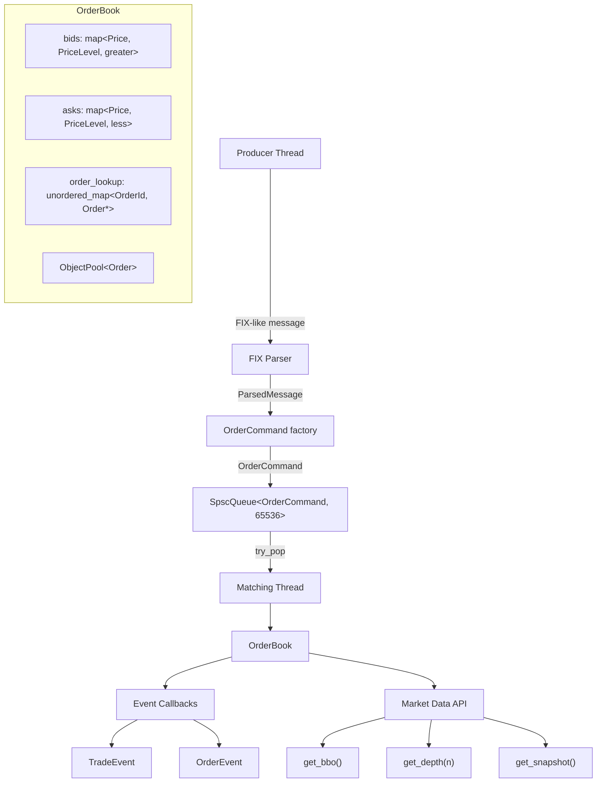

# Order Matching Engine

A high-performance limit order book implemented in modern C++17.

[](https://github.com/dengelbarts/c-_order_matching_engine/actions/workflows/ci.yml)

## Features

- Price-time priority matching (FIFO per price level)
- Order types: Limit, Market, IOC, FOK
- Order amendments and cancellations with exchange-standard priority rules
- Lock-free SPSC queue decoupling producer and matching threads
- Memory pool for zero-allocation hot path (`ObjectPool<Order>`)
- Market data API: `get_bbo()`, `get_depth(n)`, `get_snapshot()`
- FIX-like message parser: zero-copy `std::string_view` parsing for `NEW`, `CANCEL`, `AMEND`
- Self-match prevention (CME/Nasdaq/ICE standard)
- 195 tests — ASan, TSan, and UBSan clean

## Performance

Measured on GCC 13.3, `-O3`, Release build, single core:

| Metric | Result | Target |
|--------|--------|--------|
| Sustained throughput (1M orders) | **180K orders/s** | ≥ 150K/s |
| Limit add — mean latency | **126 ns** | < 5 µs |
| Limit add — p99 latency | **173 ns** | < 10 µs |
| IOC match — mean latency | **1,367 ns** | < 5 µs |
| IOC match — p99 latency | **1,638 ns** | < 10 µs |
| 15-min soak test | **5.87B ops, 0 invariant violations** | — |

## Architecture



| Component | File | Role |
|-----------|------|------|
| `Price` / `Order` | `price.hpp`, `order.hpp` | Fixed-point price, 64-byte cache-aligned order struct |
| `PriceLevel` | `price_level.hpp` | FIFO deque per price point |
| `OrderBook` | `order_book.hpp` | Matching engine, BBO, amendments, event callbacks |
| `ObjectPool<T>` | `object_pool.hpp` | Pre-allocated slab; O(1) alloc/free on the hot path |
| `SpscQueue<T,N>` | `spsc_queue.hpp` | Wait-free ring buffer; one cache line per index |
| `OrderCommand` | `order_command.hpp` | 64-byte command struct passed through the queue |
| `MatchingPipeline` | `matching_pipeline.hpp` | Owns queue + matching thread; decouples producers |
| `FIX parser` | `fix_parser.hpp` | Zero-copy `string_view` parser for NEW/CANCEL/AMEND |

## Building

```bash
# Debug build + tests
cmake -S . -B build -DCMAKE_BUILD_TYPE=Debug
cmake --build build --parallel
ctest --test-dir build --output-on-failure

# Release build + benchmarks
cmake -S . -B build/release -DCMAKE_BUILD_TYPE=Release
cmake --build build/release --parallel
cmake --build build/release --target bench

# Sanitizer builds
cmake -S . -B build-asan  -DCMAKE_BUILD_TYPE=Debug -DENABLE_ASAN=ON
cmake -S . -B build-tsan  -DCMAKE_BUILD_TYPE=Debug -DENABLE_TSAN=ON
cmake -S . -B build-ubsan -DCMAKE_BUILD_TYPE=Debug -DENABLE_UBSAN=ON
```

## Usage

### Running the demo

```bash
cmake --build build && ./build/ome_main
```

Sample output:

```
=== Order Matching Engine Demo ===

--- Adding resting orders ---
[ORDER] OrderEvent{type=New, id=1, side=Sell, price=10.5000, orig=100, filled=0, rem=100}
[ORDER] OrderEvent{type=New, id=2, side=Sell, price=10.2500, orig=75,  filled=0, rem=75}
[ORDER] OrderEvent{type=New, id=3, side=Sell, price=10.0000, orig=50,  filled=0, rem=50}
[ORDER] OrderEvent{type=New, id=4, side=Buy,  price=9.7500,  orig=80,  filled=0, rem=80}

BBO: bid 9.7500 x 80 | ask 10.0000 x 50  |  spread: 0.2500

--- Aggressive buy (qty 120 @ 10.50) ---
[TRADE] TradeEvent{id=1, buy=6, sell=3, price=10.0000, qty=50}
[TRADE] TradeEvent{id=2, buy=6, sell=2, price=10.2500, qty=70}
[ORDER] OrderEvent{type=Filled, id=6, side=Buy, price=10.5000, orig=120, filled=120, rem=0}
```

### FIX-like message format

```
NEW|side=BUY|price=10.50|qty=100
NEW|side=SELL|qty=200|price=9.75
CANCEL|id=42
AMEND|id=7|qty=150|price=10.25
```

Fields may appear in any order. The parser returns a `ParsedMessage` with a `bool valid` flag and `const char* error` on failure.

### Using the MatchingPipeline

```cpp
MatchingPipeline pipeline;
pipeline.start();

// Any producer thread:
pipeline.submit(OrderCommand::make_new(1, Side::Buy, to_price(10.50), 100, 1, 1));
pipeline.submit(OrderCommand::make_cancel(42));

// Drains all queued commands before joining the matching thread:
pipeline.shutdown();
```

## Requirements

- CMake 3.14+
- C++17 compiler (GCC 7+, Clang 5+, MSVC 2017+)
- Google Test & Google Benchmark (fetched automatically via CMake)

## License

MIT — see [LICENSE](LICENSE).

## Documentation

See [docs/DESIGN.md](docs/DESIGN.md) for architectural decisions and trade-off discussions across all four phases.

---

## Development Timeline

25-day build from scratch. Each day is tagged for easy code review.

| Day | Date | Milestone | Tag |
|-----|------|-----------|-----|
| 1 | Feb 9 | Project setup & CMake build system | [`day-1`](../../tree/day-1) |
| 2 | Feb 10 | Fixed-point `Price` type & core enums | [`day-2`](../../tree/day-2) |
| 3 | Feb 11 | `Order` struct — 64-byte cache-aligned | [`day-3`](../../tree/day-3) |
| 4 | Feb 12 | `PriceLevel` — FIFO deque per price point | [`day-4`](../../tree/day-4) |
| 5 | Feb 13 | `OrderBook` data structures & `add_order` | [`day-5`](../../tree/day-5) |
| 6 | Feb 14 | `cancel_order`, BBO, spread | [`day-6`](../../tree/day-6) |
| 7 | Feb 15 | Limit order matching engine | [`day-7`](../../tree/day-7) |
| 8 | Feb 16 | Multi-level sweeping & self-match prevention | [`day-8`](../../tree/day-8) |
| 9 | Feb 17 | Trade & order event system with callbacks | [`day-9`](../../tree/day-9) |
| 10 | Feb 18 | **Phase 1 complete** — 86 tests, ASan clean | [`v0.1.0-core`](../../tree/v0.1.0-core) |
| 11 | Feb 19 | Market orders | [`day-11`](../../tree/day-11) |
| 12 | Feb 20 | IOC (Immediate or Cancel) orders | [`day-12`](../../tree/day-12) |
| 13 | Feb 21 | FOK (Fill or Kill) orders | [`day-13`](../../tree/day-13) |
| 14 | Feb 22 | Order amendments with priority rules | [`day-14`](../../tree/day-14) |
| 15 | Feb 23 | **Phase 2 complete** — 133 tests, ASan clean | [`v0.2.0-extended`](../../tree/v0.2.0-extended) |
| 16 | Feb 24 | Baseline benchmarks (Google Benchmark) | [`day-16`](../../tree/day-16) |
| 17 | Feb 25 | `ObjectPool<T>` — O(1) alloc, zero heap on hot path | [`day-17`](../../tree/day-17) |
| 18 | Feb 26 | Hot-path optimisation — scratch vector, branch hints | [`day-18`](../../tree/day-18) |
| 19 | Feb 27 | Realistic benchmark suite — sustained, latency, deep-book | [`day-19`](../../tree/day-19) |
| 20 | Feb 28 | **Phase 3 complete** — 180K orders/s, all targets met | [`v0.3.0-performance`](../../tree/v0.3.0-performance) |
| 21 | Mar 1 | `SpscQueue<T,N>` — wait-free lock-free ring buffer | [`day-21`](../../tree/day-21) |
| 22 | Mar 2 | `MatchingPipeline` — producer/consumer threading | [`day-22`](../../tree/day-22) |
| 23 | Mar 3 | Market data API & FIX-like message parser | [`day-23`](../../tree/day-23) |
| 24 | Mar 4 | GitHub Actions CI, DESIGN.md, soak test | [`day-24`](../../tree/day-24) |
| 25 | Mar 5 | **v1.0.0** — clang-format, UBSan, interview prep | [`v1.0.0`](../../tree/v1.0.0) |

```bash
git checkout day-10   # Phase 1 completion
git checkout v1.0.0   # Final version
git diff day-1..day-10
```
